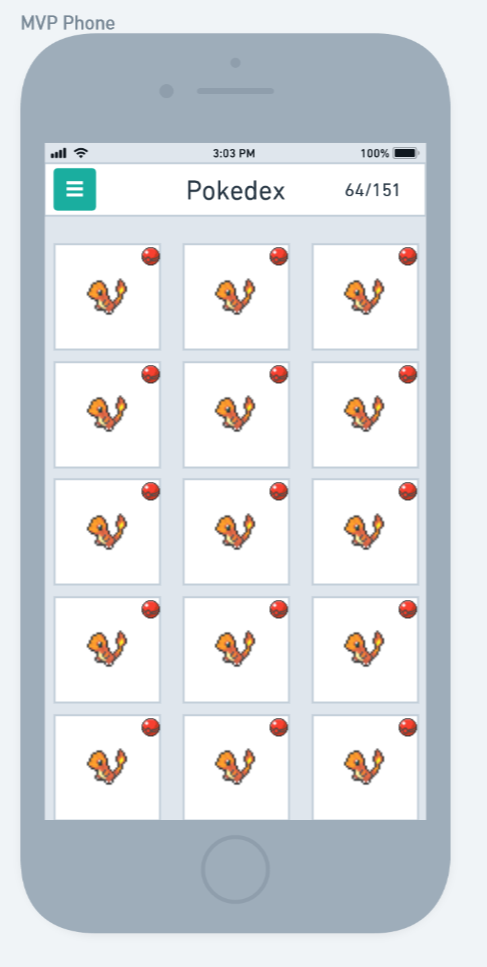
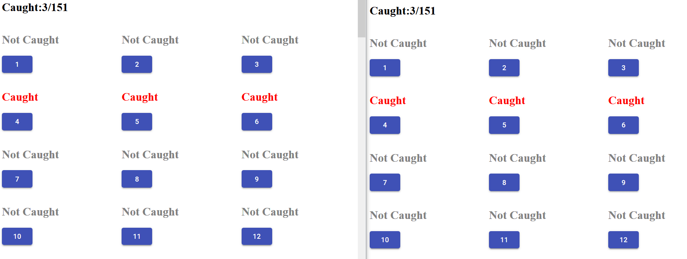
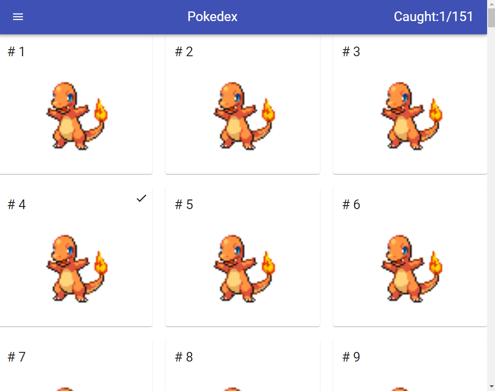
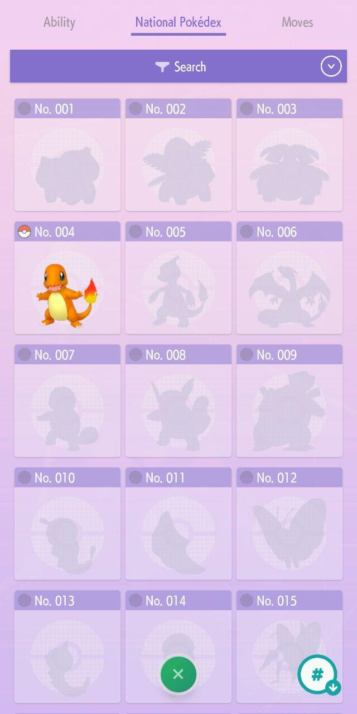

# Collaborative Pokedex App

`MVP Complete: Many clients can update the progress of the Pokedex`

Wanna see it? Head to:  https://pokedex-party.web.app/

- Use the default user and check/uncheck the Pokemon Cards to mark them as caught/not caught.

---

This app allows you to track progress on a Pokedex __with friends__. This app is useful is many people want to help each other in getting a living dex as well. __Everyone will have the same pokedex completion progress.__

```
Disciplines/Technologies
- Use of Firebase
    - Hosting
    - Authentication
    - Database
- Use of react
- Use of redux
- Developed a client
- Developed an express server (Only for the first iteration)
```

Here's the first wireframe mockup.




`The current repository has a React-Redux MVP completely functional`


## First Express-React Prototype UI



## Current Version UI

This is how it currently looks



## The Pokemon Home App UI

The following is the Pokemon Home App design. 👇



__Coincidentally__, my design has wireframe similarities between the two of them.

## Future work

 Next steps would be probably implement a better UI, try to export it as a desktop or mobile app.

 Even later work will be to separate Pokemon from regions and add the national dex. And now that Animal Crossing has arrived on Nintendo Switch, I intend to add the Critterpedia to use for this app.