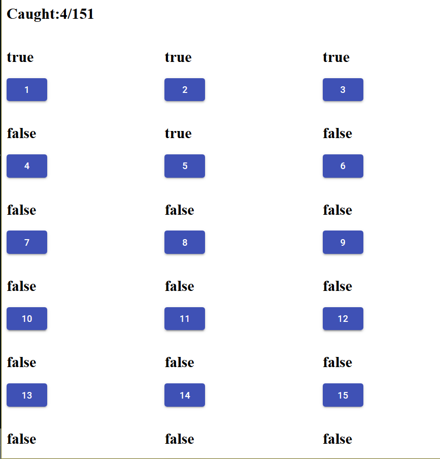

# Collaborative Pokedex App

`Progress: MVP Client with 1 User is working. It is now time to work on the collaborative part.`

This app allows you to track progress on a Pokedex __with friends__. This app is useful is many people want to help each other in getting a living dex as well. __Everyone will have the same pokedex completion progress.__

Here's the first wireframe mockup.

`The current repository has a React-Redux MVP completely functional and it looks like this.`

For now, data is saved on the browser. The next part is to work on the collaborative part, where users can see the synced version of the same pokedex they joined. It is time to do server work.